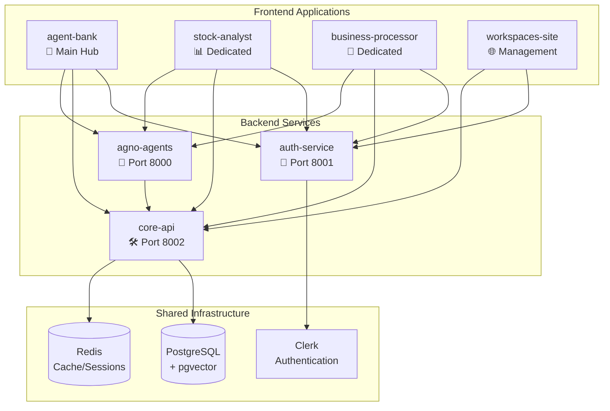

# 🏗️ Project Restructure - Complete Summary

## ✅ **Successfully Completed Restructure**

We have successfully restructured the AJ Copilot project into a clean, multi-frontend architecture with separated concerns.

## 📁 **New Project Structure**

```
aj-copilot/
├── apps/
│   ├── agent-bank/                    # 🏦 Main AI Agent Hub (renamed from simple-agent-ui)
│   ├── auth-service/                  # 🔐 Standalone Authentication Service
│   ├── core-api/                      # 🛠️ Core Backend Services
│   ├── agno-agents/                   # 🤖 Pure AI Agent Implementations
│   ├── workspaces-site/               # 🌐 Workspace Management UI
│   ├── ai-chat-api/                   # 💬 Legacy Chat API
│   ├── crewai-agents/                 # 🔬 CrewAI Research Agents
│   ├── mastra-dev/                    # ⚡ Mastra Development
│   └── python-app/                    # 🐍 Python App Template
├── docs/
│   ├── database-design/               # 📊 Database Architecture
│   └── project-restructure/           # 🏗️ Restructure Documentation
└── pnpm-workspace.yaml                # 📦 Workspace Configuration
```

## 🎯 **What Changed**

### **1. Frontend Restructure**
- ✅ **`simple-agent-ui/` → `agent-bank/`**: Renamed main frontend to reflect its role as an AI agent hub
- ✅ **Clean Architecture**: Separated concerns between frontend and backend services

### **2. Backend Service Separation**
- ✅ **`auth-service/`**: Extracted authentication from `agno-agents/`
  - Clerk integration & JWT validation
  - Organization management
  - B2B multi-tenant support
  - FastAPI-based standalone service
- ✅ **`core-api/`**: Created foundation for shared backend services
  - Database management (PostgreSQL + pgvector)
  - File storage management
  - Vector search capabilities
  - Agent state management
  - Conversation management
  - Workspace management

### **3. AI Agent Focus**
- ✅ **`agno-agents/`**: Now focused exclusively on AI agent implementations
  - Stock Analysis Agent
  - Ringi System Agent
  - BPP Assistant Agent
  - Generic Agent
  - Removed authentication concerns
  - Clean separation of agent logic

## 🚀 **Service Architecture**



## 📋 **Service Details**

### **🏦 agent-bank (Port 3000)**
- **Purpose**: Main AI agent hub - "bank" of all AI agents
- **Tech**: Next.js, TypeScript, Tailwind CSS, Clerk
- **Features**: 
  - Unified agent interface
  - Settings management
  - Organization management
  - Multi-agent chat interface

### **🔐 auth-service (Port 8001)**
- **Purpose**: Standalone authentication service
- **Tech**: FastAPI, Python, Clerk integration
- **Features**:
  - JWT validation
  - Organization creation/management
  - User management
  - B2B multi-tenant support

### **🛠️ core-api (Port 8002)**
- **Purpose**: Shared backend services
- **Tech**: FastAPI, Python, PostgreSQL, pgvector
- **Features**:
  - Database operations
  - File management
  - Vector search (RAG)
  - Agent state persistence
  - Conversation management

### **🤖 agno-agents (Port 8000)**
- **Purpose**: Pure AI agent implementations
- **Tech**: FastAPI, Python, Agno AI framework
- **Features**:
  - Stock Analysis Agent
  - Ringi System Agent
  - BPP Assistant Agent
  - Generic Agent
  - AG-UI protocol compliance

## 🎯 **Benefits Achieved**

### **1. Separation of Concerns**
- ✅ Authentication isolated to dedicated service
- ✅ AI agents focused on core functionality
- ✅ Shared backend services centralized
- ✅ Frontend applications can be specialized

### **2. Scalability**
- ✅ Multiple frontend applications can share backend services
- ✅ Independent service scaling
- ✅ Clear service boundaries
- ✅ Microservices architecture

### **3. Maintainability**
- ✅ Single responsibility principle
- ✅ Clear project structure
- ✅ Independent development cycles
- ✅ Easier testing and debugging

### **4. Future-Ready**
- ✅ Ready for dedicated frontend apps (stock-analyst, business-processor, etc.)
- ✅ Shared backend services for consistency
- ✅ Database schema designed for multi-tenant B2B
- ✅ Vector search capabilities for RAG agents

## 🔄 **Migration Status**

### **✅ Completed**
- [x] Renamed `simple-agent-ui` to `agent-bank`
- [x] Extracted `auth-service` from `agno-agents`
- [x] Created `core-api` foundation
- [x] Updated `agno-agents` to focus on AI agents only
- [x] Updated documentation and READMEs
- [x] Committed state to GitHub

### **🔄 In Progress**
- [ ] Update import paths in frontend applications
- [ ] Update service configurations
- [ ] Test all services work together

### **📋 Next Steps**
- [ ] Update frontend API calls to use new service ports
- [ ] Implement database schema in `core-api`
- [ ] Add file management to `core-api`
- [ ] Test end-to-end functionality
- [ ] Deploy services independently

## 🚀 **Ready for Development**

The restructure is complete and ready for:
1. **Independent service development**
2. **Multiple frontend applications**
3. **Shared backend services**
4. **Scalable multi-tenant architecture**

Each service can now be developed, tested, and deployed independently while sharing common infrastructure through the `core-api` and `auth-service`.
